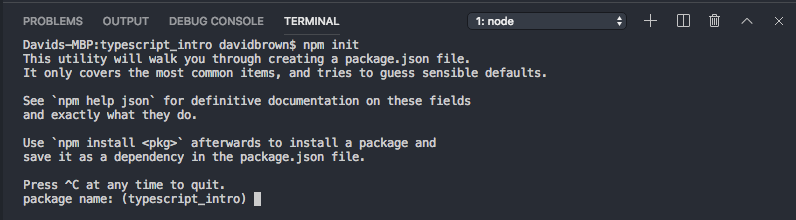

# PIXI 5, TypeScript & Webpack - Quick Setup

Make sure you install the latest version of **[https://node.js](https://nodejs.org)**.

Github repositories do not include the "node_module" folder so in the terminal you need to run:

**npm i**

And then to build the game by running:

**npm run build**

To run the game locally run:

**http-server**

And select the **/dist** folder.

# PIXI 5, TypeScript & Webpack - How to build this yourself from scratch

Setting up your first PIXIJS / Typescript project can be a little daunting, this tutorial is to remind myself and hopefully help someone else get started.

## Topics

1.  [Prerequisites](#prerequisites)
2.  [Create Package.json](#package)
3.  [Install Pixi](#pixi)
4.  [Install TypeScript](#typescript)
5.  [Configuring TypeScript](#typescript_config)
6.  [Install Webpack](#webpack)
7.  [Configuring Webpack](#webpack_config)
8.  [Install http-server](#httpserver)
9.  [Folder Structure](#structure)
10.  [Quick Typescript Example](#quick_typescript)
11.  [Running The Game](#run_game)
12.  [Demo](#demo)

## Prerequisites

- Install the latest version of **[https://node.js](https://nodejs.org)**  
- Install a code editor, I recommend Visual Studio Code **[https://code.visualstudio.com](https://code.visualstudio.com/)**  
- A short version of this tutorial can be found here **[pixi-typescript-webpack-tldr.html](pixi-typescript-webpack-tldr.html)**  

## Create Package.json

Create a new folder and open it in Visual Studio Code.  
In Visual Studio Code select **"View"** from the top menu system and click **"Terminal [^`]"**

> If you are using different code editor, open up the command line (Windows) or Terminal (Mac) and "cd" to the folder

In the terminal run:

    npm init

The terminal will then ask you a few questions about your project. (These can be editted later in the package.json)  
  
It should automatically create a package.json file in your project folder that looks like this:  
**package.json**

    {
      "name": "typescript_intro",
      "version": "1.0.0",
      "description": "",
      "main": "index.js",
      "scripts": {
        "test": "echo \"Error: no test specified\" && exit 1"
      },
      "author": "",
      "license": "ISC"
    }

## Install Pixi

In the terminal run:

    npm i pixi.js

> **Note:** More info on installing Pixi can be found here: [https://github.com/pixijs/pixi.js](https://github.com/pixijs/pixi.js)

This will automatically create a "node_module" folder. Node will store all of the downloaded libraries here. It will also add pixi.js to the list of dependencies in the package.json  

> **Note:** With npm installs you can download a specific version by including @version after the name for example npm i pixi.js@4.8.8.

## Install TypeScript

In the terminal run:

    npm i --save-dev typescript

> **Note:** More info on installing Typescript can be found here: [https://www.typescriptlang.org/docs/tutorial.html](https://www.typescriptlang.org/docs/tutorial.html)

The **--save-dev** lets the project know this library is only needed for development so it will not be included in the final .js file.

## Configuring TypeScript

In the terminal run:

    tsc -init

This will create a **tsconfig.json** file in the project folder. The tsconfig.json defines how Typescript will compile into Javascript. The automatically generated tsconfig.json will have a lot of options commented out.  

The only option we have to change right now is **- rootDir**. This is because our Typescript files will be in the src folder not the project's root folder.

    {
      "compilerOptions": {
        "target": "es5",
        "module": "commonjs",
        "rootDir": "./src",
        "esModuleInterop": true
      }
    }

> **Note:** Its worth learning tsconfig.json options, some can be really helpful, more information can be found here: [https://www.typescriptlang.org/docs/handbook/compiler-options.html](https://www.typescriptlang.org/docs/handbook/compiler-options.html)

## Install Webpack

In the terminal run:

    npm i --save-dev webpack
    npm i --save-dev webpack-cli

> **Note:** More info on webpack installation can be found here: [https://webpack.js.org/guides/getting-started/](https://webpack.js.org/guides/getting-started/)

Webpack has many great plugins but for now we only need two:  
**- awesome-typescript-loader**: allows Webpack to read and compile Typescript files.  
**- uglifyjs-webpack-plugin**: creates a game.min.js which greatly reduces the .js file size.

    npm i --save-dev awesome-typescript-loader
        npm i --save-dev uglifyjs-webpack-plugin

## Configuring Webpack

In the root project folder create a file called **webpack.config.js**  
Webpack code is a little tricky and describing this code is probably a tutorial in its owns right but we basically want to load the two plugins and tell it where the source files are and where we want them to export too.  

Create a new file called **webpack.config.js** and copy in this code:

    const path = require("path");
    const UglifyJsPlugin = require('uglifyjs-webpack-plugin');
    const { CheckerPlugin } = require('awesome-typescript-loader')
    const PACKAGE = require('./package.json');

    // Library output details
    var FILE_NAME = "game";
    var LIBRARY_NAME = PACKAGE.name;

    // Build, source, etc paths
    var PATHS = {
      entryPoint: path.resolve(__dirname, 'src/index.ts'),
      dist: path.resolve(__dirname, 'dist')
    }

    // Webpack config
    module.exports = {
      mode: "production",
      entry: {
        [FILE_NAME]: [PATHS.entryPoint],
        [FILE_NAME + '.min']: [PATHS.entryPoint]
      },
      output: {
        path: PATHS.dist,
        filename: '[name].js',
        libraryTarget: 'umd',
        library: LIBRARY_NAME,
        umdNamedDefine: true
      },
      resolve: {
        extensions: ['.ts', '.tsx', '.js']
      },
      optimization: {
        minimize: true,
        minimizer: [new UglifyJsPlugin({
          include: /\.min\.js$/
        })]
      },
      module: {
        rules: [{
          test: /\.tsx?$/,
          loader: 'awesome-typescript-loader',
          exclude: /node_modules/,
          query: {
            declaration: false,
          }
        }]
      },
      plugins: [
        new CheckerPlugin()
      ],
    }

The important bit is to make sure the entry and exit paths:

    var PATHS = {
       entryPoint: path.resolve(__dirname, 'src/index.ts'),
       dist: path.resolve(__dirname, 'dist')
    }

And to create a file named game.js

    var FILE_NAME = "game";

We can run the wepack by typing into the termnal: webpack --config webpack.config.js  
but that is a pain to type every time you want to compile. To make this quicker we can add a run command into the package.json  

In the package.json file, within the "scripts" node you can add shortcut to trigger webpack commands:

    "scripts": {
      "build": "webpack --config webpack.config.js",
    },

> **Note:** You can create multiple run commands in the package.json. You can run them by writting: **npm run [NAME]**, for this example we would write **npm run build**

## Install http-server

Modern browsers won't allow you to access files directly from your device, during development we use a virtual server so we can run games locally In the terminal run:

    npm i --save-dev http-server

## Folder Structure

Now all of the libraries are installed your package.json should look something like this:  
**package.json**

    {
      "name": "typescript_intro",
      "version": "1.0.0",
      "description": "",
      "main": "Index.js",
      "scripts": {
        "build": "webpack --config webpack.config.js",
        "test": "echo \"Error: no test specified\" && exit 1"
      },
      "author": "",
      "license": "ISC",
      "dependencies": {
        "pixi.js": "^5.2.0"
      },
      "devDependencies": {
        "awesome-typescript-loader": "^5.2.1",
        "http-server": "^0.11.1",
        "typescript": "^3.6.3",
        "uglifyjs-webpack-plugin": "^2.2.0",
        "webpack": "^4.40.2",
        "webpack-cli": "^3.3.9"
      }
    }

In the project folder create a folder called **dist/**. This is where your final project files will be created.  
In the dist/ folder create an **Index.html** file. As a bare bones example your index.html could just be:  
**index.html**

    <html>
      
      <body></body>
    </html>

Also in the dist/ folder create an **assets/** folder, this is where we will store any assets for the game like images or sound files.  
as an example you can download this image into the assets folder:  
  
In the project folder create a **src/** folder. This is where all your Typescript files will go. In the src/ folder create the **Index.ts**  

Your project folder should look like this:

    |- /dist/
      |- /assets/
        |- gecko.png
      |- index.html
    |- /node_modules/
    |- /src/  
      |- Index.ts
    |- package.json
    |- webpack.config.js

## Quick Typescript Example

Phew, this tutorial is getting long, lets just create a rotating image:  
**src/index.ts**

    import * as PIXI from 'pixi.js';

    export class GameManager{
       private app:PIXI.Application;

       public constructor(){
    	  this.app = new PIXI.Application({ width: 400, height: 400, backgroundColor: 0xFFFFFF });	
    	  document.body.appendChild(this.app.view);

    	  this.app.loader.add('gecko', 'assets/gecko.png');
    	  this.app.loader.on("complete", this.onLoadComplete.bind(this) );
    	  this.app.loader.load();
       }

       private onLoadComplete( loader:PIXI.loaders.Loader, resources:PIXI.loaders.ResourceDictionary ):void{
          //create a sprite from a 'gecko.png' image
          let gecko:PIXI.Sprite = new PIXI.Sprite(resources.gecko.texture);

          //position the gecko in the center of the screen
          gecko.x = this.app.renderer.width / 2;
          gecko.y = this.app.renderer.height / 2;

          //add an anchor so the rotate pivots the center of the image
          gecko.anchor.x = 0.5;
          gecko.anchor.y = 0.5;

          //add the gecko to the screen
          this.app.stage.addChild(gecko);

          //listen for frame updates
          this.app.ticker.add(() => {
             //each frame spin the gecko around a tiny bit
             gecko.rotation -= 0.01;
          });
       }
    }

    window.onload = function () {
    	new GameManager();
    }

    window.PIXI = PIXI

## Running The Game

With all of that done the only thing left for us to do is launch the game. In the Terminal run:

    npm run build

This should tell the webpack to compile the Typescript into Javascript and bundle all the files into a new dist/game.js  

> **Note:** It might give you a warning saying the .js file is large but that is because it is your game code plus the pixi.js and all of its dependencies, in the final release you can swap the game.js in the index.html with game.min.js to reduce the file size

In the Terminal run:

    cd dist

So your Terminal is now pointing to the dist/ folder  
And run:

    http-server

And now copy the local link it provides, in my case its: [http://127.0.0.1:8080](http://127.0.0.1:8080)  
Hopefully your game will load. If not, check the Chrome debugger, chances are it will show you what went wrong.  

> **Note:** During development I find it really helpful to use the game.js, so you can see errors plainly in the Chrome debugger. But for your final release its better to change the script link in the index.html to game.min.js, its the same code but compressed and will be a far smaller file size.

